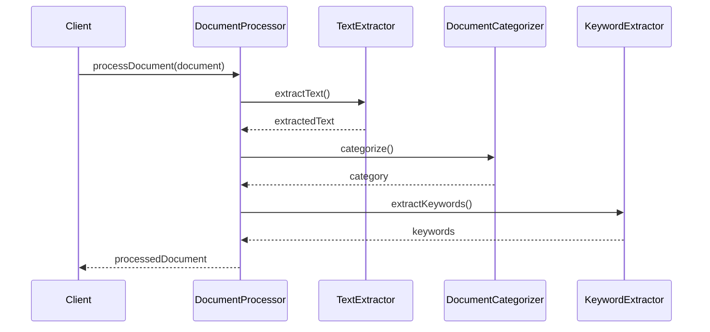

# 상세 기능 명세: 핵심 공통 기능 (Core Services)

## 1. 개요

`core` 패키지는 문서 중앙화 시스템의 모든 기능 모듈에서 공통으로 사용되는 핵심 로직과 데이터 모델을 포함합니다. 문서 처리의 기본 파이프라인을 제공하며, 다른 기능 모듈들이 일관된 방식으로 문서를 처리할 수 있도록 지원합니다.

*   **위치**: `documentprocessor/core/`

## 2. 주요 클래스 및 역할

### 2.1. `DocumentProcessor`

*   **설명**: 문서 처리의 전체 흐름을 관장하는 오케스트레이터(Orchestrator) 클래스입니다. `TextExtractor`, `DocumentCategorizer`, `KeywordExtractor`와 같은 핵심 처리 모듈들을 통합하여 문서 처리 파이프라인을 구성합니다.
*   **메서드**:
    *   `processDocument(Document document)`: 입력된 `Document` 객체를 받아 다음의 파이프라인을 순차적으로 실행합니다:
        1.  `TextExtractor`를 사용하여 문서에서 순수 텍스트를 추출합니다.
        2.  `DocumentCategorizer`를 사용하여 추출된 텍스트를 기반으로 문서의 카테고리를 분류합니다.
        3.  `KeywordExtractor`를 사용하여 문서의 핵심 키워드를 추출합니다.
        최종적으로 이 모든 처리 결과를 `ProcessedDocument` 객체로 캡슐화하여 반환합니다.

### 2.2. `processing` 패키지 (`documentprocessor/core/processing/`)

*   `TextExtractor`: PDF, DOCX, TXT 등 다양한 포맷의 문서에서 순수 텍스트 콘텐츠를 추출하는 역할을 합니다. 현재는 간단한 텍스트 추출 로직을 시뮬레이션하며, 실제 구현에서는 Apache Tika와 같은 외부 라이브러리와 연동하여 지원 포맷을 확장할 수 있습니다.
*   `DocumentCategorizer`: 추출된 텍스트의 내용을 분석하여 문서를 사전에 정의된 카테고리(예: Finance, Legal, General)로 분류합니다. 현재는 키워드 기반의 단순한 분류 로직을 사용합니다.
*   `KeywordExtractor`: 문서의 핵심 내용을 대표하는 주요 단어 또는 구(Phrase)를 추출합니다. 현재는 간단한 공백 기반 단어 분리 및 불용어(Stopwords) 필터링 로직을 사용하며, TF-IDF나 TextRank 같은 알고리즘을 적용하여 정확도를 높일 수 있습니다.

### 2.3. `model` 패키지 (`documentprocessor/core/model/`)

*   `ProcessedDocument`: 문서 처리 파이프라인의 최종 결과물입니다. 다음 정보를 포함합니다:
    *   `extractedText` (String): 원본 문서에서 정제되어 추출된 순수 텍스트.
    *   `category` (String): `DocumentCategorizer`에 의해 할당된 문서의 카테고리.
    *   `keywords` (List<String>): `KeywordExtractor`에 의해 추출된 문서의 핵심 키워드 목록.

### 2.4. 기타 핵심 객체

*   `Document`: 시스템이 처리할 원본 문서를 나타내는 클래스입니다. 각 문서는 고유 ID(`id`), 바이너리 내용(`content`), 그리고 문서의 종류(`DocumentType`)를 가집니다.
*   `DocumentType`: 문서의 종류(예: INVOICE, CONTRACT, LEGAL, FINANCIAL, GENERAL, CONFIDENTIAL, UNKNOWN)를 정의하는 열거형(Enum)입니다. 시스템이 처리할 수 있는 다양한 문서 유형을 나타냅니다.
*   `MatchResult`: DLP 기능에서 민감 정보 탐지 결과를 나타내는 레코드(Record) 클래스입니다. 불변(immutable) 객체로, 탐지된 민감 정보 패턴의 이름(`patternName`)과 문서에서 실제로 탐지된 텍스트(`foundText`)를 저장합니다.

## 3. 처리 흐름

