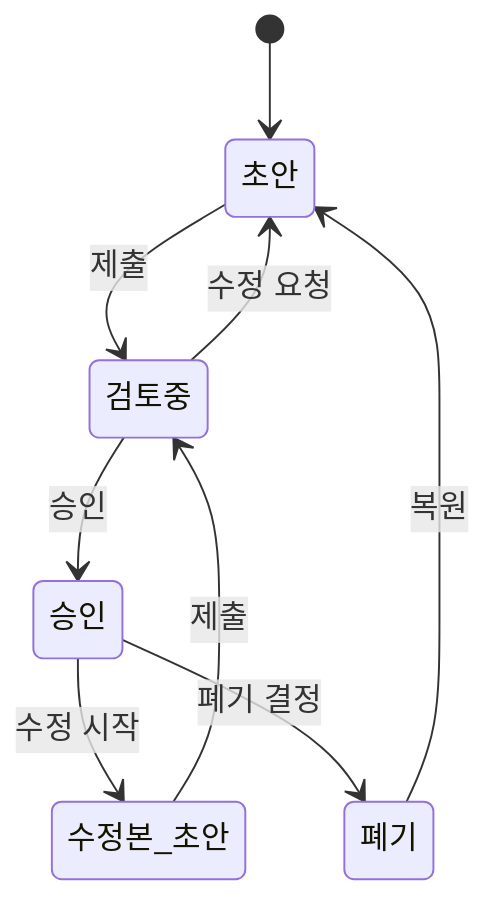

# 상세 기능 명세: 문서 형상 관리 (RD-SRS-9.x)

## 1. 개요

`rd_srs_9_version_control` 패키지는 문서의 생성, 수정, 폐기 등 전체 생명주기를 체계적으로 관리하고, 문서 버전을 제어하는 기능을 담당합니다. 이를 통해 문서의 무결성을 보장하고, 변경 사항을 추적하며, 필요 시 특정 시점의 버전으로 복원할 수 있습니다.

*   **위치**: `documentprocessor/rd_srs_9_version_control/`
*   **주요 클래스**: `VersionControlService` (Facade) 및 4개의 하위 서비스

## 2. 아키텍처

`VersionControlService`는 퍼사드(Facade) 역할을 수행하며, 실제 로직은 다음과 같이 책임이 분리된 4개의 서비스 클래스에 위임됩니다.

*   `VersioningService` (RD-SRS-9.1, 9.4, 9.5): 버전 생성, 조회, 비교, 특정 시점 버전 조회 등 핵심 버전 관리 기능을 담당합니다.
*   `DocumentLifecycleService` (RD-SRS-9.2, 9.6, 9.7, 9.8): 문서 상태(초안, 승인, 폐기 등) 및 승인 워크플로우, 문서 폐기/복원을 관리합니다.
*   `VersionEventService` (RD-SRS-9.3, 9.9): 버전 변경 이력 로깅 및 이해관계자 알림을 담당합니다.
*   `VersioningPolicyService` (RD-SRS-9.10): 버전 보관 정책(최대 버전 수, 보관 기간 등) 설정을 담당합니다.

```mermaid
graph TD
    A[요청] --> B{VersionControlService (Facade)};
    B --> C[VersioningService];
    B --> D[DocumentLifecycleService];
    B --> E[VersionEventService];
    B --> F[VersioningPolicyService];

    subgraph 기능 수행
        C --> G[버전 생성/조회/비교];
        D --> H[상태 변경/워크플로우];
        E --> I[이력 로깅/알림];
        F --> J[정책 설정];
    end
```

## 3. 주요 기능 및 메서드

### 3.1. `VersionControlService`

*   `checkIn(...)`: 문서 저장 및 새 버전 생성을 총괄합니다. 각 하위 서비스를 조율하여 버전 할당, 이력 기록, 내용 저장, 상태 설정, 알림 전송 등을 수행합니다.
*   `compareVersions(...)`: `VersioningService`에 위임하여 두 버전 간의 내용 차이를 비교합니다.
*   `getVersionAtTime(...)`: `VersioningService`에 위임하여 특정 시점의 문서 버전을 가져옵니다. (RD-SRS-9.5)
*   `disposeDocument(...)` / `restoreDocument(...)`: `DocumentLifecycleService`에 위임하여 문서를 폐기하거나 복원합니다. (RD-SRS-9.8)

### 3.2. `VersioningService`

*   `assignVersion(...)`: 새 버전 번호를 부여합니다. (RD-SRS-9.1)
*   `compareVersions(...)`: 두 버전의 텍스트를 줄 단위로 비교하여 차이점을 반환합니다. (RD-SRS-9.4)
*   `getVersionAtTime(...)`: 지정된 타임스탬프 이전에 존재했던 마지막 버전을 찾아 반환합니다. (RD-SRS-9.5)

### 3.3. `DocumentLifecycleService`

*   `setDocumentStatus(...)`: 문서의 상태(초안, 검토중, 승인, 폐기 등)를 설정합니다. (RD-SRS-9.6)
*   `initiateApprovalWorkflow(...)`: 문서 승인 절차를 시작합니다. (RD-SRS-9.7)
*   `disposeDocument(...)` / `restoreDocument(...)`: 문서 상태를 '폐기'로 설정하거나 이전 상태로 복원합니다. (RD-SRS-9.8)

### 3.4. `VersionEventService`

*   `logVersionChange(...)`: 버전 변경 메타데이터를 기록합니다. (RD-SRS-9.3)
*   `notifyStakeholders(...)`: 주요 변경 이벤트 발생 시 이해관계자에게 알림을 전송합니다. (RD-SRS-9.9)

### 3.5. `VersioningPolicyService`

*   `setVersioningPolicy(...)`: 최대 버전 수, 보관 기간 등 형상 관리 정책을 설정합니다. (RD-SRS-9.10)

## 4. 상태 전이 다이어그램



## 5. 요구사항 매핑 (RD-SRS-9.x)

| 요구사항 ID | 설명 | 구현 클래스 및 메서드 |
| --- | --- | --- |
| **RD-SRS-9.1** | 자동 버전 번호 부여 | `VersioningService.assignVersion` |
| **RD-SRS-9.2** | 문서 생명주기(상태) 관리 | `DocumentLifecycleService.setDocumentStatus` |
| **RD-SRS-9.3** | 버전 변경 이력(로그) 기록 | `VersionEventService.logVersionChange` |
| **RD-SRS-9.4** | 버전 간 차이점 비교 | `VersioningService.compareVersions` |
| **RD-SRS-9.5** | 특정 시점의 문서 버전 조회 | `VersioningService.getVersionAtTime` |
| **RD-SRS-9.6** | 문서 상태 설정 | `DocumentLifecycleService.setDocumentStatus` |
| **RD-SRS-9.7** | 문서 승인 워크플로우 시작 | `DocumentLifecycleService.initiateApprovalWorkflow` |
| **RD-SRS-9.8** | 문서 폐기 및 복원 | `DocumentLifecycleService.disposeDocument`, `restoreDocument` |
| **RD-SRS-9.9** | 이해관계자에게 자동 알림 | `VersionEventService.notifyStakeholders` |
| **RD-SRS-9.10**| 버전 관리 정책 설정 | `VersioningPolicyService.setVersioningPolicy` |